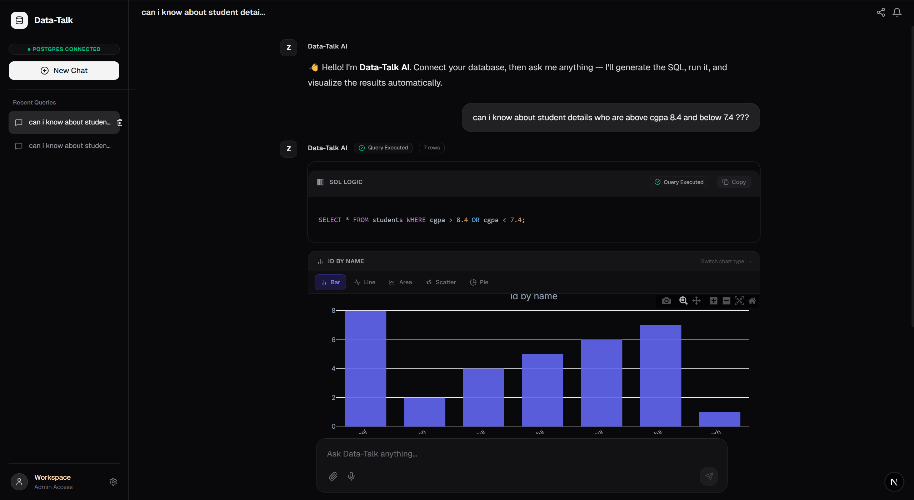
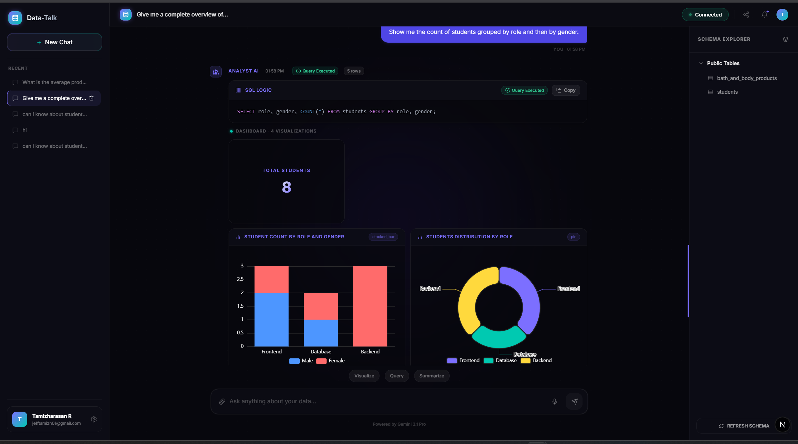
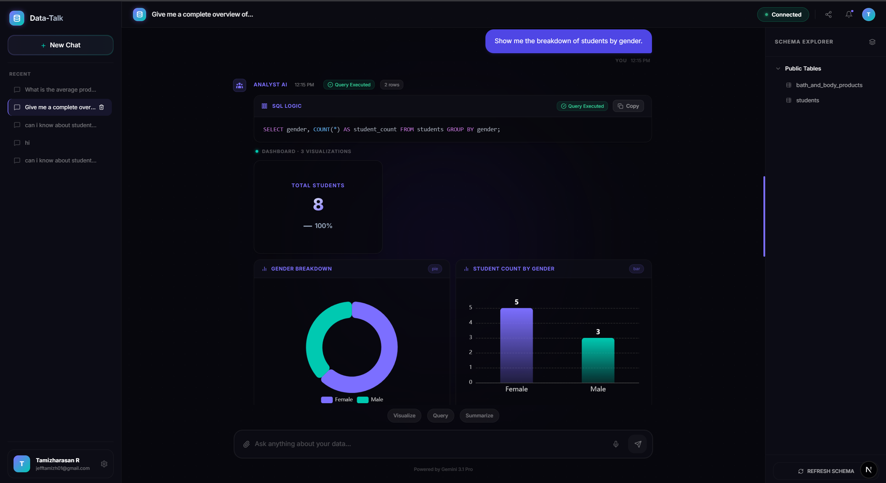

# Data-Talk AI 🧠

An enterprise-grade Conversational AI platform that lets non-technical users **chat with their PostgreSQL database in plain English**. Just type a question — Data-Talk generates the SQL, runs it securely, renders interactive charts, and writes a plain-English summary of the results — all in real-time.



---

## ✨ Key Features

- **Multi-Agent Pipeline** — Dedicated AI agents for routing, SQL generation, QA review, visualization, and analysis — each using the model best suited to its task.
- **Text-to-SQL** — Claude 3.5 Sonnet converts natural language questions into optimized, accurate PostgreSQL queries.
- **Auto-Visualization** — Gemini Pro analyzes query results and picks the best 3-4 charts from 15 chart types (Bar, Line, Donut, Scatter, Gauge, KPI cards, Radar, etc.). Rendered with Apache ECharts.
- **Self-Correcting SQL** — A QA Agent (Llama 3 70B) reviews and auto-fixes generated SQL before it hits the database.
- **Schema RAG** — Uses pgvector + LlamaIndex to find only the relevant tables before generating SQL — no full schema dumps to LLMs.
- **Real-time Streaming** — Responses stream step-by-step via Server-Sent Events (SSE). Users see each stage as it completes.
- **Prompt Injection Guard** — Security layer blocks prompt-injection attempts before any AI agent is invoked.
- **Result Caching** — Redis caches query results, so repeated questions return instantly.
- **Enterprise Security** — All queries are read-only (`SELECT`/`WITH` only). No writes, updates, or deletes are possible.
- **Any PostgreSQL DB** — Connect to any PostgreSQL database at runtime via the connect modal (supports full connection strings including schema path).

---

## 📸 Screenshots

**Chat Interface — Query with auto-generated SQL and KPI cards**



**Dashboard View — Multi-chart visualization panel from a single question**



---

## 🏗️ Architecture

```
User (Browser)
     │  POST /api/ask  (SSE stream)
     ▼
┌────────────────────────────────────────────────────┐
│                  FastAPI Backend                   │
│                                                    │
│  ┌─────────┐   ┌──────────┐   ┌────────────────┐  │
│  │ Router  │   │SQL Agent │   │   QA Agent     │  │
│  │Llama 3  │   │Claude 3.5│   │  Llama 3 70B   │  │
│  │  8B     │   │ Sonnet   │   │                │  │
│  └─────────┘   └──────────┘   └────────────────┘  │
│                                                    │
│  ┌─────────────┐   ┌──────────┐   ┌────────────┐  │
│  │  Visualizer │   │ Analyst  │   │  Security  │  │
│  │ Gemini Pro  │   │Gemini Pro│   │  + Cache   │  │
│  └─────────────┘   └──────────┘   └────────────┘  │
│                                                    │
│  pgvector (Schema RAG)  ←→  PostgreSQL (User DB)  │
└────────────────────────────────────────────────────┘
     │
     ▼
Next.js Frontend (Chat UI + ECharts)
```

### Pipeline Stages (per request)
1. **Security Gate** — Blocks prompt injection
2. **Cache Check** — Returns instantly if result is cached
3. **Router Agent** — Classifies as `sql` or `chat`
4. **Schema Retrieval** — pgvector finds relevant tables
5. **SQL Agent** — Claude 3.5 generates SQL
6. **QA Agent** — Llama 3 70B reviews and fixes SQL
7. **SQL Execution** — Read-only query on user's DB
8. **Visualizer Agent** — Gemini picks and configs 3-4 charts
9. **Analyst Agent** — Gemini writes plain-English summary
10. **Cache** — Stores result in Redis

---

## 🛠️ Tech Stack

### Backend
| Component | Technology |
|---|---|
| API Framework | FastAPI (Python, async) |
| SQL Generation | Claude 3.5 Sonnet (via OpenRouter) |
| Router & QA | Groq — Llama 3 8B / 70B |
| Visualization & Analysis | Google Gemini Pro |
| Schema Search | LlamaIndex + pgvector |
| Database Driver | SQLAlchemy + asyncpg |
| Caching | Redis |

### Frontend
| Component | Technology |
|---|---|
| Framework | Next.js 14 (TypeScript, App Router) |
| Styling | Tailwind CSS + Shadcn/UI |
| Charts | Apache ECharts (via `echarts-for-react`) |
| Auth | Supabase Auth |
| State | React Context |

---

## 🚀 Quick Start

### Prerequisites
- Node.js 18+
- Python 3.11+
- A PostgreSQL database to connect to
- API keys: Groq, OpenRouter, Google Gemini, Supabase

### 1. Clone & configure backend

```bash
cd backend
python -m venv venv
# Windows:  venv\Scripts\activate
# Mac/Linux: source venv/bin/activate

pip install -r requirements.txt
cp .env.example .env
# Edit .env with your API keys and DB URL
```

**`.env` keys required:**
```env
GROQ_API_KEY=...
OPENROUTER_API_KEY=...
GEMINI_API_KEY=...
SUPABASE_URL=...
SUPABASE_KEY=...
```

**Run the backend:**
```bash
uvicorn app.main:app --reload --port 8000
```

### 2. Frontend setup

```bash
cd frontend
npm install
npm run dev
```

### 3. Open the app

Navigate to **http://localhost:3000** → connect your PostgreSQL database → start chatting!

---

## 🔒 Security Model

| Layer | Protection |
|---|---|
| Application | `guard_prompt()` blocks prompt injection before any AI call |
| Lexical | Only `SELECT` and `WITH` queries are allowed — hard-coded regex |
| Database | SQLAlchemy engine uses `postgresql_readonly: True` — makes writes impossible |
| Limits | All queries capped at 1000 rows to prevent memory issues |

---

## 📁 Project Structure

```
RAG/
├── backend/
│   ├── app/
│   │   ├── agents/          ← AI agents (router, sql, qa, visualizer, analyst, orchestrator)
│   │   ├── core/            ← DB connection, schema indexer, security, cache
│   │   ├── routes/          ← FastAPI route handlers
│   │   ├── config.py        ← Environment settings
│   │   └── main.py          ← App entry point
│   └── requirements.txt
├── frontend/
│   ├── src/
│   │   ├── app/             ← Next.js pages (chat, login, profile, auth callback)
│   │   ├── components/      ← UI components (ChatWindow, ChartRenderer, Sidebar, etc.)
│   │   └── lib/             ← API client, auth context, chat context
│   └── package.json
├── Docs/                    ← Team documentation
│   ├── 01-system-overview.md
│   ├── 02-agent-roles.md
│   ├── 03-visualization-pipeline.md
│   └── 04-data-flow.md
└── docker-compose.yml
```

---

## 📖 Documentation

Full documentation for the team is in the [`Docs/`](./Docs/) folder:

| File | Contents |
|---|---|
| [01-system-overview.md](./Docs/01-system-overview.md) | What Data-Talk is, big-picture diagram, tech table |
| [02-agent-roles.md](./Docs/02-agent-roles.md) | Each agent's job with examples |
| [03-visualization-pipeline.md](./Docs/03-visualization-pipeline.md) | Exact step-by-step chart generation pipeline |
| [04-data-flow.md](./Docs/04-data-flow.md) | Full request traced start-to-finish with timestamps |

---

## 👥 Team

| Role | Members |
|---|---|
| Frontend Development | Kubendiran, Sravya |
| Backend & AI Logic | Divya, Rishitha, Ramya, Tamizharasan |
| Database Management | Abhilesha, Goel |

---

## 📜 License

This project is for educational and portfolio purposes.
